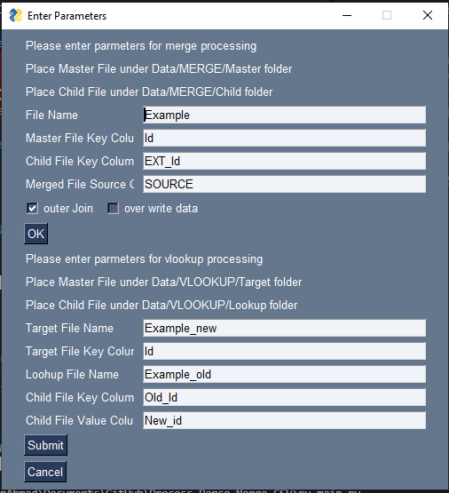

#  Process - Parse - Merge CSV
1. Merge CSV
2. Process CSV for VLOOKUP

# Modules Required
1. [Python](https://www.python.org/downloads/)
2. [Pandas](https://pypi.org/project/pandas/)
3. [Numpy](https://pypi.org/project/numpy/)
4. [PySimpleGUI](https://pypi.org/project/PySimpleGUI/)
5. [PsUtill](https://pypi.org/project/psutil/)

# Run Setup to install required dependency
```
python setup.py
```

# Run Simple GUI 
```
python main.py 
```


# MERGING GUIDE

## Merge Features
 Merging CSV by using outer/inner join.

 Identifies Duplicates by Key column fields, left key and right key

 copies cell data from child to parent if empty or overwrites parent cell

 Merges Cell Header of master and child CSV 

 Keeps track of record source 

## Setup
1. Place master csv in Data/MERGE/Parent Folder 
2. Place child csv in Data/MERGE/Child Folder
3. Make Sure master and child csv names are equal
4. Find Merged file in Data/MERGE/Result Folder
5. Find Logs in Data/MERGE/Log folder 


## Pre-run configuration 
### variable values in parameters.py file
1. FILE_NAME: update this variable with the file name of CSV
2. VALUES_TO_BE_REPLACED_BY_NULL: array list which contains the values that will be replaced by null
3. PARENT_KEY_FILED: Key column value in a master CSV file using which record is searched in child CSV
4. CHILD_KEY_FIELD: Key column value in a child CSV file using which records are matched and used to merge with the parent record
5. COLOUM_NAME_WHERE_RECORD_SOURCE_TO_BE_STORED: column name that is added to merged CSV representing record source is Master, Child or Master/Child
6. MERGE: Defaults to "inner" merge i.e only common records are merged and exported to merged CSV. If set to "outer" common records are merged from Master and Child CSV and unique records are added in merged CSV
7. OVERRIDE: if it is set to True.data of child record  will be overwritten in master record cell even if exists 

## Supported function 
### Variables values in merge.py file
1. MERGHEADERS: if it is set to True column's from parent and child are merged
2. DROPEMPTYHEADERS: if it is set to True column's that do not have any value are removed from CSV
3. DATACLEANUP: if it is set to True values given in "VALUES_TO_BE_REPLACED_BY_NULL" array are replaced by null
4. DROPEMPTYROWS: if it is set to True any empty row from CSV is removed
record

# Run Merge Script
For running a script to merge 2 CSV
```
python merge.py
```


## Example 
### Master Example.csv

| Id | Name |  Email  |
| -- | ---- | ------- | 
| 2  |  Bb  |         |
| 3  |      | C@b.com |
| 4  |  Db  | D@b.com |
| 6  |  Gb  |         |
| 8  |      | F@b.com |

### Child Example.csv

| EXT_Id | Name |  Email  |
| ------ | ---- | ------- | 
|   1    |  Ab  | a@b.com |
|   2    |      | b@b.com |
|   3    |  Cb  |         |
|   4    | asdf |as@df.com|
|   5    |      |         |

### CSV after Outer Join

| Id | Name |  Email  | EXT_Id |     SOURCE   |
| -- | ---- | ------- | ------ | ------------ |   
|  6 |  Gb  |         |        |    Master    |
|  2 |  Bb  | b@b.com |   2    | Master/Child |
|  3 |  Cb  | C@b.com |   3    | Master/Child |
|  4 |  Db  | D@b.com |   4    | Master/Child |
|  8 |      | F@b.com |        |    Master    |
|    |  Ab  | a@b.com |   1    |    Child     |
|    |      | a@b.com |   5    |    Child     |

### CSV after inner Join with override False

| Id | Name |  Email  | EXT_Id |     SOURCE   |
| -- | ---- | ------- | ------ | ------------ |   
|  2 |  Bb  | b@b.com |   2    | Master/Child |
|  3 |  Cb  | C@b.com |   3    | Master/Child |
|  4 |  Db  | D@b.com |   4    | Master/Child |

### CSV after inner Join with override True

| Id | Name |  Email  | EXT_Id |     SOURCE   |
| -- | ---- | ------- | ------ | ------------ |   
|  2 |  Bb  | b@b.com |   2    | Master/Child |
|  3 |  Cb  | C@b.com |   3    | Master/Child |
|  4 | asdf |as@df.com|   4    | Master/Child |


# VLOOKUP GUIDE

## Setup
1. Place target CSV in Data/Parent Folder 
2. Place  CSV containing data from where values are to be fetched  in Data/Child Folder
3. Find the Processed file in Data/Result Folder
4. Find Logs in Data/Log folder 

## Pre-run configuration 
### variable values in parameters.py file
1. TARGET_FILE_NAME: Filename in which values are to be replaced
2. TARGET_FILE_KEY_COLUMN_NAME: Column name in target file in which values are to be searched and replaced
3. LOOKUP_FILE_KEY_COLUMN_NAME: column name in which value is to be searched 
4. LOOKUP_FILE_VALUE_COLUMN_NAME: column name from which value is fetched to be replaced in the target file
5. VALUES_TO_BE_REPLACED_BY_NULL: array list which contains the values that will be replaced by null

# Run Vlookup Script
For running a script to merge 2 CSV
```
python vlookup.py
```

## Example 
### Target Example_new.csv
|Id|Name|
|-|-|
|1|a|
|2|b|
|3|c|
|4|d|
|5|e|
| |f|
| |g|
| |i|
| |j|

### Lookup Example_old.csv
|Old_Id|New_id|Name|
|-|-|-|
|1|100|a|
|1|1000|aa|
|2|200|b|
|3|300|c|
|4|400|d|
|5|500|e|
|6|600|FF|
|7|700|GG|
|8|800|HH|

### Lookup Processed Example_new.csv
|Id|Name|
|-|-|
| |f|
| |g|
| |i|
| |j|
|100|a|
|200|b|
|300|c|
|400|d|
|500|e|
